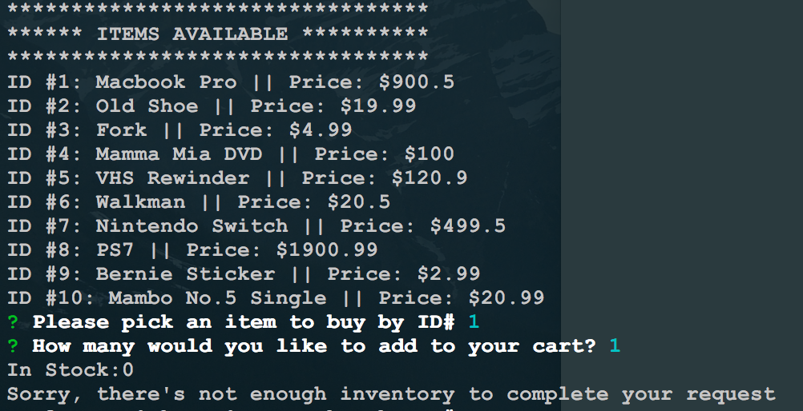
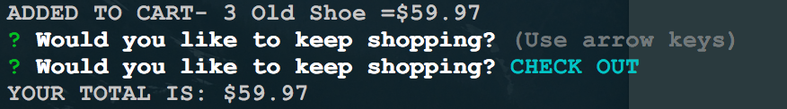
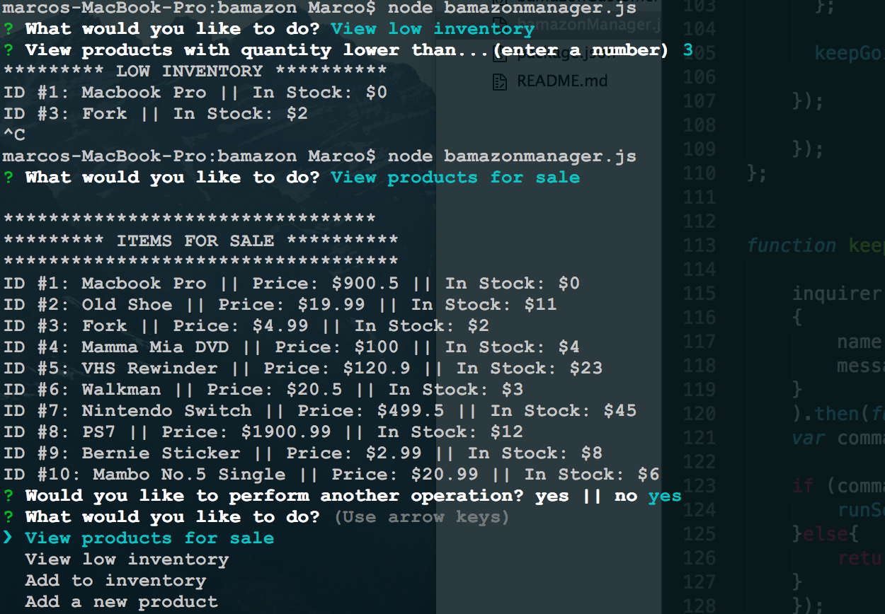
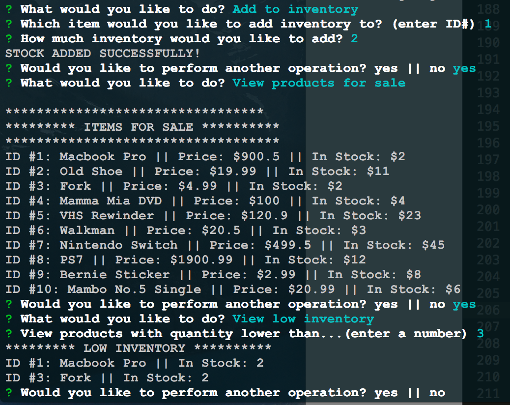

**Bamazon App** 
An app that interacts with a database using 8Node.js8 and 8MySQL8.  The app works similarly to Amazon, where a user can deplete the store inventory or add new items to it.   

As a **CUSTOMER** you can:

1. **VIEW INVENTORY** and it will tell you if
there's **NO INVENTORY** to complete your order:

2. after every item added to your cart you will be prompted to see if you would like to **CHECK OUT** or **KEEP SHOPPING* if you CHECKOUT your **TOTAL** will be displayed.

As a **MANAGER** you can:

1. **VIEW LOW INVENTORY** and specify the minimum.

2.**ADD STOCK** where you can select an item by *ID* and *UPDATE* it's stock.

